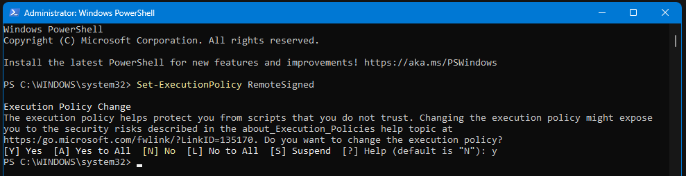
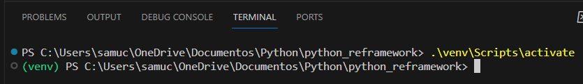

# Python REFramework

This project is a clone of REFramework (Robotic Enterprise Framework) designed by UiPath. Including state machines, clone of all workflows and transactional project.

## Installation

- Activate your system to execute scripts. In this case, to activate venv in this project.
    - Open PowerShell in admin mode.
    - Put this code to allow venv activation:  ``Set-ExecutionPolicy RemoteSigned`` send Enter,  type ``Y``, and send Enter again.

- Activate and deactivate your venv.
    - To activate, type in terminal: ``.\venv\Scripts\activate``
    - The name of your venv will appear in terminal like this image:

## Usage

----

## Contributing

Samuel Ferraz de Araujo (Senior RPA Developer)

https://www.linkedin.com/in/samuel-software-engineer/

## License

--

